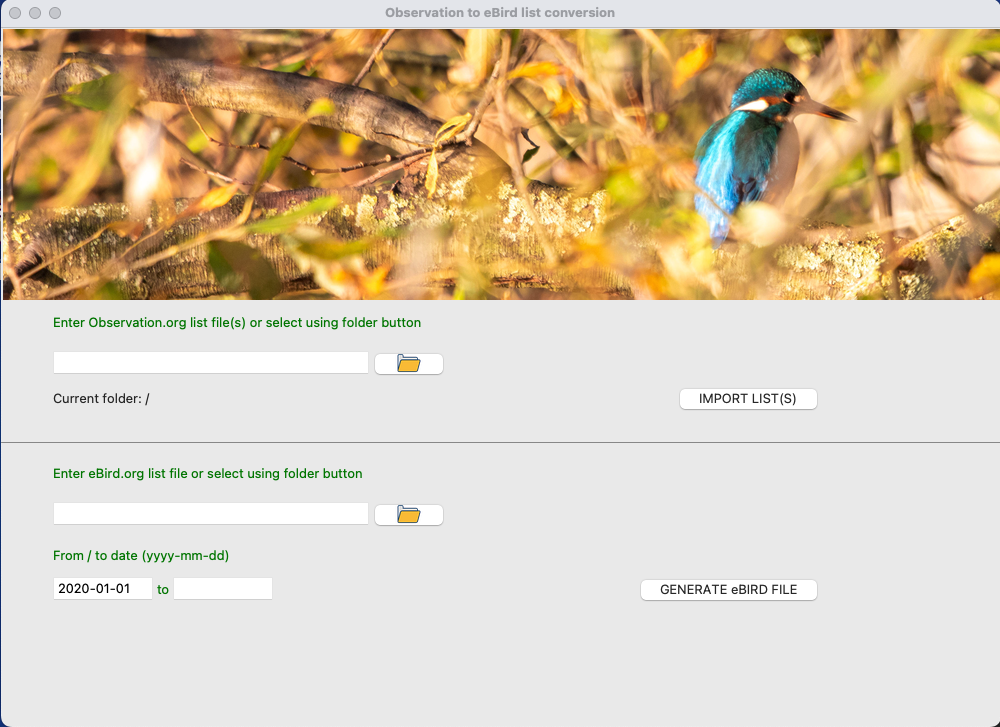

# Bird's observation list conversion from Observation.org to eBird.org format

This program enables the conversion from [Observation.org](http://observation.org) to [eBird.org](http://eBird.org)
observation lists.

Start the GUI by executing the command:
    
    python o2eb.py

## Export from observation.org

- Lists from Observation.org need first to be downloaded in .CSV format.
  From the GUI, enter the Observations list file(s) (.csv format) or select them by clicking on the folder icon and navigating to the file(s). Then press the Ìmport List(s)`button
- Lists can also be imported into a local database by executing the CLI command:

       $ python obs2ebird.py -i "<path_to_observations_files/*.csv>"

## Import file for eBird.org

- The import file for eBird.org observation is created by
  - giving a name to the output file
  - selecting a start date and optionally an end date to filter out the required information
  - to generate the output, press the `GENERATE eBird FILE` button.

  - It can also be executed by the CLI command:

        $ python obs2ebird.py -o "<path_to_ebird_file.csv>" [--from start_date] [--to end_date] 

  - Date are expressed in the ISO format "yyyy-mm-dd"

  - The file can now be imported to [eBird import form](https://ebird.org/import/upload.form?theme=ebird), selecting the observation list option

  - Note that a mapping is sometime needed between the provided species names and/or location names and the one accepted by eBird. This mapping is saved between sessions.

## Optional - Use of MySQL database (technical information)

MySQL database is also supported. 

In that case, the .config/config.yaml file in your $HOME director should be modified as follows:

      default:
        db_dialect: mysql

      mysql:
        host: <url>>
        port: <port>
        db: <db name>

The `get_secrets.py` module should be adapted in order to manage the database user and password retrieval in order to log in the MySQL database
The provided example read user and password from a Hashicorp Vault where a `secrets.yml` file locally stores the token to access the vault.